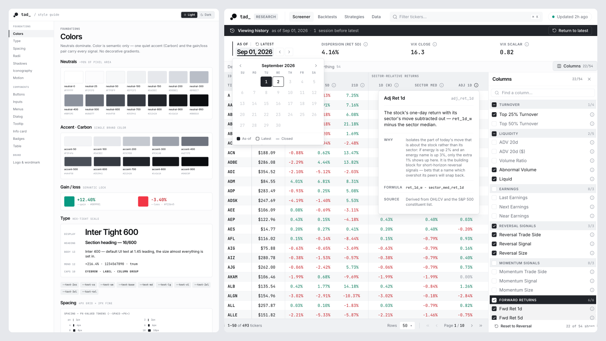

# Getting Out of the Loop: 8 Months Solo-Building with AI

*An experience report · Patric Fornasier · September 2026 · 25 min read*

It was late March. I got up to work early and found that some overnight tasks hit my 5h usage limit. Slightly panicked and wondering how I could possibly work for the next two hours, I put my laptop away and took out a pen and some paper. I organised my thoughts and started to think through a number of topics. One at a time. With an uncluttered, undistracted mind and single focus. It was the most productive two hours I'd had in a long time.

But let's start at the beginning...

## Context

After quitting my job in October 2025, I decided to take some time off and focus full-time on building something non-trivial with AI. I wanted to see what's truly possible, separate hype from reality, understand where and how things break, and how to push past these limits. Most importantly, I wanted to understand how it changes the way we design, build, and run complex software systems.

As a challenge, I wanted to see if I could solo-build a quant fund with AI. The goal wasn't to make money but to pick a hard domain that would force me deep into building with AI.

## Part 1 – Getting Sucked In (Nov–Jan)

### Tooling Up

Back in October 2025, my understanding was that the state of the art in building with AI was basically "auto-complete on steroids". I first encountered AI-assisted auto-complete during my last few months at Google in 2022. I then transitioned into a leadership role and was pretty hands-off for the following three years. I occasionally used Cursor on some personal projects but never became a huge fan and found the suggestions actually more annoying than helpful overall. I also tinkered a bit with Jules, Cline, and Aider but wasn't too impressed and didn't see the use case yet.

When I started the project at the end of November 2025, things on the agentic side had just started to change in a meaningful way (Opus 4.5 was released just a few days earlier). I took a week to explore the tooling landscape before diving into the project. I had some outstanding tasks on a personal project, and implemented them five times over with Cursor, Antigravity, Gemini CLI, Codex CLI, and Claude Code (CC).

Like so many others around that time and over the following months, this was my holy f\*ck moment. I realised that things had dramatically moved on from "auto-complete on steroids".

I immediately liked the ergonomics of the CLI-based tools and CC emerged as my favourite pretty quickly. I felt the quality of its output was a notch above the others, and I liked the harness and the persona. So, after a few days, that was settled.

Over the months, I experimented with different setups but always came back to simply running CC inside tmux + VS Code for reading and reviewing. As a solo dev, I don't use PRs but iterate on changes locally.

### Building

The following six weeks were some of the most fun. I knew what to build: data pipelines, backtesting infra, metrics, and analytics – none of which required deep domain knowledge. I was very excited about the newly gained superpowers.

But I was also still very much building in the same way that I built without AI. I wasn't ready to loosen the reins yet. I had seen and cleaned up too many legacy codebases and I wasn't going to let that happen to this codebase. So I was working in baby steps, prompt after prompt generating relatively small snippets of code. I'd review every generated line and spend a significant amount of time rewriting generated code by hand and moving things around. Some of it probably was OCD, but a lot of it was necessary course-correcting if I wanted this codebase to still be readable and maintainable in a few weeks' time. That was also when it became clear to me that trying to just vibe code a system like this would almost certainly leave you with a mess you couldn't understand or own.

In hindsight, all this rework was tedious but paid off: over the following weeks, the codebase started to stabilise – structure, patterns, practices, style, and conventions started to emerge and solidify. In turn, CC started to generate code that was much more aligned with what was already there and I started spending less time nudging or reworking.

As the codebase grew, however, inconsistencies started to creep in again (e.g. duplication instead of reuse, ignoring conventions, style drift). My assumption as to why this happened was that the codebase started getting too big for CC's context window and it would miss exploring relevant areas of the codebase. As a result, my time spent on reviews and feedback went up again, as I was still driving implementation through prompts and manual reviews.

Initially, I put a lot of rules into CLAUDE.md but it was hit and miss and got worse as I added more rules. So, instead of adding more rules, I started to enforce design rules, conventions, and gotchas mechanically as automated tests whenever I could (see example below). That, together with the fact that there were now a lot of examples in the codebase of "how we do things here", seemed to work better than the long CLAUDE.md files to get CC to generate code in line with the existing codebase.

```python
class TestNoForwardReturnLeakage:
    def test_no_forward_return_token_in_quant_consumers(self) -> None:
        violations = []
        for pkg in PACKAGES:
            for path in _all_py_files(pkg):
                if path == FORWARD_RETURN_PRODUCER:
                    continue
                for lineno, line in enumerate(path.read_text().splitlines(), start=1):
                    if "fwd_ret" in line.lower():
                        violations.append(f"{path}:{lineno}: {line.strip()}")
        assert not violations, "Forward returns must never feed a signal, strategy, or backtest:\n" + "\n".join(violations)
```

*A trimmed example of a test catching look-ahead bias at build time rather than via a suspiciously good backtest.*

Over time, CLAUDE.md shrank down to primarily process stuff or gotchas that were hard to encode or infer from the codebase alone. Things like "Always run `just check-all` before committing", "No PRs", "Branches only in worktrees".

### Burning

This new way of working was extremely addictive and all-consuming. I'd spend 10+ hours a day, hardly taking breaks, no meetings, no interruptions, just one dopamine hit after another. I was extremely busy and produced a lot of output. I was context switching all the time, and at the end of the day I felt completely drained. I'd recharge overnight and then do the same thing again the next day. It was the slot machine effect in full force. I was optimising my day and energy levels as much as I could but after about two months I reached a point where I realised that I couldn't sustain this pace of working indefinitely.

I was thinking back to my previous jobs and realised that, if I was lucky, I'd probably get 3–4h of deep focus time in a day and the rest was spent on cognitively less demanding tasks. Before AI, building software was this dance where I'd switch between system 1 (fast) and system 2 (slow) thinking (see [*Thinking, Fast and Slow*](https://en.wikipedia.org/wiki/Thinking,_Fast_and_Slow)) – thinking hard about a problem (system 2), but then entering a flow state during coding, which was more mechanical, automatic (system 1), and in a way replenishing. With AI, I spent pretty much my entire day in system 2 mode because the mechanical part had been outsourced to AI.

To make things worse, I was context switching between three and five tasks at a time because I naïvely believed that not having any agents running meant lost productivity. I was running hot and I was burning out.

Around the same time, I came across a post by Steve Yegge called ["The AI Vampire"](https://steve-yegge.medium.com/the-ai-vampire-eda6e4f07163). It was the first time I'd read about others feeling drained by this new type of work and having no sense of when they'd had enough. Over the following months, many others would [report](https://simonwillison.net/2026/Apr/2/lennys-podcast/) [similar](https://stackoverflow.blog/2026/05/21/coding-agents-are-giving-everyone-decision-fatigue/) [experiences](https://addyosmani.com/blog/cognitive-parallel-agents/).

### Bottlenecking

It was about two months into the project. I had gotten quite comfortable driving CC and was routinely running 3–6 instances in parallel. Most of the time, though, they were simply waiting for my input.

I had so much work to do but also became very aware that simply adding more agents wouldn't make things faster. The bottleneck was me: I couldn't think things through and decide what to build faster than a few agents could build it. And, output quality was very variable and I still spent a lot of time reviewing and course-correcting.

I had tech led teams of 10+ engineers many times before. But I struggled to run and keep three CC instances busy. At first, I thought it was an orchestration problem. I started using a Kanban board, populated it with "tasks", and got agents to pull from it. It didn't work.

I still struggled to feed the system with enough well-thought-through tasks. And if I didn't spend enough time defining a task or tried to one-shot something beyond a certain complexity, the result usually wasn't great – sh\*t in → sh\*t out. But even when a task _was_ well defined, implementation quality varied. Bottom line: I still got interrupted all the time and spent more time reviewing, course-correcting, or rewriting than I wanted to.

This was clearly different from running a team of 10+ human engineers.

### Two Models Are Better Than One

Feeding the system faster didn't seem like an option. I had to learn and understand the domain and I had to define what to build next – both of which I was already doing at an accelerated pace thanks to AI. This wasn't something I could meaningfully accelerate further or delegate to AI. The fantasy of having an armada of agents that would "just build stuff" autonomously 24/7 showed its first cracks. But the handholding, reviewing, and course-correcting still felt like the wrong use of my time. And that I could fix.

Around the end of January, I accidentally made an interesting discovery: implementation quality seemed to dramatically increase if I used a panel of models – especially models from different families.

Codex was gaining traction around that time and I was trying it out to implement a task. There were some issues with the implementation and I gave the same task to CC for comparison. CC's implementation wasn't flawless either but it got some things right that Codex got wrong and vice versa. I let them look at each other's implementation, so they could learn from it and improve their own. Which they did!

I ran a few more experiments. Interestingly, the biggest quality improvement seemed to come from the planning stage. In other words, once you have a good implementation plan, a single model seems to produce work that's roughly on par with what multiple models would produce. My guess as to why is that, given a good plan, implementation is fairly mechanical and straightforward (which goes back to my earlier point about system 1 and system 2 thinking).

The other finding was that using two models from the same family (e.g. two Opus agents or an Opus and a Sonnet agent) still improved things, but to a much lesser degree than when using models from different families (e.g. Opus plus GPT or Gemini). This obviously wasn't a scientific experiment and the sample size was single digit. There's also a confound I can't rule out. Switching model family meant switching harnesses, so some of what I put down to perspective may just be scaffolding. But in the samples I ran, the improvement was surprisingly consistent – both subjectively and when scored by an LLM judge against a rubric. The finding seems to be corroborated by the [literature](https://github.com/patforna/auto-task/blob/main/docs/research/2026-03-13-dialectic-planning-for-agents.md), which attributes the gains to diversity of perspective, with different model families giving you the most of it.

I started applying the insights. Of course the time spent on implementation planning went up. But so did implementation quality, which in turn meant that I had to spend less time course-correcting.

I later wrote a few lightweight, reusable skills around this idea. Instead of relying on a single model, I use a [`panel`](https://github.com/patforna/core-skills/blob/main/skills/panel/SKILL.md) of models that independently generate a response and have another model [`synthesize`](https://github.com/patforna/core-skills/blob/main/skills/synthesize/SKILL.md) the output. These skills are fairly generic and I use them for implementation planning and reviews. I also use [`sop`](https://github.com/patforna/core-skills/blob/main/skills/sop/SKILL.md), which is a stripped-down version that can be called interactively mid-conversation to get a second opinion on the topic at hand from another model.

Mechanically, it's pretty simple. Each model gets the same prompt in a fresh context and doesn't see what the others come up with. There's no back-and-forth, so it's always a single round. Another model synthesises the responses – what they agree on, where they disagree – without forcing consensus. Disagreements that survive are deliberately left for the caller to resolve.

Six months on, cross-family panels are still one of the techniques I rely on the most to improve output quality. That said, I wish I didn't have to, and hope that models will improve over time so that these sorts of hacks and band-aids won't be necessary anymore.

## Part 2 – Going Round in Circles (Feb–Apr)

### Driving the Research Loop

By early February, the initial bout of building was over. I had enough infra and an initial strategy ready to backtest. The result was a slap in the face: the strategy sucked and performed worse than flipping coins would have...

I spent the following days digging into the data, stared at charts for hours on end, tried to learn more about the domain, made changes to the strategy, ran backtests, fed results back into the strategy, and kept iterating. After a few very monotonous days, I realised that most of what I was doing was pretty mechanical and an LLM could probably drive the research loop faster and better than I could.

Everything I had built so far was accessible via CLI, and most of the data was in local Parquet files and easy to query via DuckDB. And I had an objective evaluation function to optimise against. So getting CC to run the experiments and evaluate the results was straightforward. This definitely accelerated the research loop but it still required some handholding and was rather ad hoc. For example, I still evaluated the results and decided what to integrate and what to reject.

My plan was to let CC drive the entire research loop, including hypothesis generation, evaluation, and evolution. Indeed, shortly after, Andrej Karpathy published a small project called [autoresearch](https://github.com/karpathy/autoresearch), which described the same idea. But I felt somewhat uncomfortable with CC generating hypotheses and insights that I was unable to sanity check due to my insufficient depth of domain expertise. This was quite different from having CC generate code, where I could assess quite quickly and confidently if something made sense or not.

### Honeymoon's Over

So I did a lot more reading and domain research to understand how best to evolve the strategy. Almost all of it driven through CC. Then, something happened that completely threw me and also permanently changed my relationship with AI.

I had previously made a number of fundamental, strategic pivots. I had high confidence in the decisions I made because they were the result of long, deep conversations with Claude and the reasoning seemed convincing. After weeks of building on those decisions, a new Claude instance would, in passing, propose the opposite and, when challenged, actually dig its heels in and produce an equally convincing defence of the opposite position.

One example I remember was concentration: the idea I had built on, with confidence, was to sit in cash by default and deploy meaningfully into a few names when a high-conviction setup shows up. Claude argued it well at the time. I challenged. It held its ground. I trusted it. Later, another instance told me, with the same confidence, that the evidence shows that more independent positions beat a few big ones (Grinold's Fundamental Law of Active Management). I pushed back again. It held its ground. Again, in a very convincing manner.

This experience really rattled me. It completely destroyed my trust in LLMs. I started to doubt everything I had discussed, believed, and built on. I was no longer able to trust the model in areas where I wasn't an expert. Without noticing, I had just taken things at face value because I didn't know better.

In hindsight, and understanding better how LLMs work, it was of course naïve to trust LLMs fully in the first place. I guess I got blinded by the light and hype, seeing them for something they're not. Yes, they obviously are extremely useful but they aren't reliable sources of truth. I felt frustrated about the wasted time and wasn't sure how to continue. Addy Osmani later gave this a name I wish I'd had at the time: [cognitive surrender](https://addyosmani.com/blog/cognitive-surrender/) – the AI's confidence quietly becoming your own, with no independent view left to check it against.

### Back to the Drawing Board

Trust was gone. Confidence in what I had built so far, too. On top of that, the strategy performed abysmally. So, towards the end of March, I went back to the drawing board, scrapped the strategy and rebuilt a new one from scratch. But this time grounded in findings I could trust.

So instead of asking one model, I had a team of agents search with different strategies, cite their sources, synthesise the results, and then had independent reviewers go over it all for gaps and inaccuracies. As I now had findings in artefacts on disk rather than in conversations I'd never find again, I'd re-run the research multiple times over the following months (especially after a new model release) to check whether they still held, or whether anything new turned up. Admittedly, this approach was very heavy-handed, and I burnt through a lot of tokens during that time. But it did the trick and I was able to build on what came out of it with confidence. I later packaged the process up as a [`research`](https://github.com/patforna/core-skills/blob/main/skills/research/SKILL.md) skill.

### Pen and Paper

After days of deep agent-driven research and learning, it became clear that I had to throw away the initial strategy and build a new strategy from the ground up. The new strategy required extracting and computing about 30 signals from multiple data sources (market data, positioning, SEC filings, corporate events, etc.).

Then came the morning I described at the start: sessions ran through the night and hit my usage limit, and with two hours to fill I took out pen and paper.

In those two hours I gained clarity about certain steps I had to take that I don't think I'd have ever gained while strapped into the agent loop. I've had similar experiences outside of work, spending countless hours talking something through with an LLM, going in circles, and then having a breakthrough moment or completely new insight into the topic through a conversation with another human. There still seems to be a quality in the human mind and human-to-human interaction that doesn't exist in AI or human-to-AI interaction.

I now regularly try to step away from AI and technology to spend time thinking. I always get a lot out of it, including feeling re-energised. But I also admit that it's a really hard thing to do and so much easier to just fire up CC and get those dopamine hits #slotMachine.

## Part 3 – Getting Out of the Loop (Apr–Jul)

### Optimising for Humans, Too

One of the insights that came out of the pen-and-paper session was that, while I had learnt a lot about the domain, I still didn't have a good intuition about the data I was dealing with.

I had rejected the idea of building a frontend multiple times. I felt it wasn't a good investment of time because it wasn't needed for CC to operate and drive the research loop. Until then, I had optimised the experience primarily for CC. But I also felt uncomfortable letting CC drive the research and product evolution without having some intuition about whether its actions were sound or just sounded good.

I realised that for this collaboration to be effective, I needed to consider not only AI needs but also my needs. And I, like most humans, can process visual data much more effectively than purely numerical or textual data. I therefore decided – against CC's advice – to build a frontend. Not for AI but for myself. It was one of the better decisions I made in this project, as it really helped me get a better understanding of and intuition for the data. And it was quite fun, too.

### Frontend

I'm not a frontend engineer but over the course of 20 years, I've worked closely with many frontend engineers and designers and have a fairly good idea of what good looks like. This was my first time building a production-grade frontend with AI and the experience was overwhelmingly positive, which, I believe, came down to a few key factors:

1. Tech stack. Choosing a good frontend stack is half the battle. I chose TS, React, Vite, TanStack, Tailwind, and shadcn (Thanks a bunch for the recommendation, [@jackblackCH](https://github.com/jackblackCH)!).
2. Foundations. Locking down patterns, practices, style, testing strategy.
3. Feedback loops. Type checking, linting, test automation, browser and DevTools access (for layout geometry, console errors, performance).
4. LLMs seem pretty good at frontend. I assume that's because there's a lot of training data, components are typically small and self-contained, and the boilerplate-to-logic ratio is high.

### Claude Design

I wanted the frontend to not only be functional but also to have a good UX and look great. It was late May. Google's Stitch and Anthropic's Claude Design (CD) were out by then. I tried both, got immediately better results from CD, and stuck with it.

It was clear to me that one-shotting a UI wouldn't give me something I could maintain and evolve over a longer period of time. So I invested a day to lay foundations first: a design system, style guide, and a small component library from which I built v0 of the frontend. I also locked down collaboration rules in the respective CLAUDE.md files for how I wanted design (CD) and eng (CC) to collaborate (design owns the visuals and produces pixel-perfect specs in plain HTML/CSS; eng owns the implementation and checks with design before touching anything visual). That day paid off massively later.

Over time, I automated the handoffs in both directions: I use CC to write a design brief ([`create-design-brief`](https://github.com/patforna/core-skills/blob/main/skills/create-design-brief/SKILL.md)) that gets pushed to CD. I then iterate inside CD and get it to produce a pixel-perfect design spec, which CC ingests ([`ingest-design`](https://github.com/patforna/core-skills/blob/main/skills/ingest-design/SKILL.md)), implements, and verifies using DevTools. I rarely have to touch the implementation these days.

[](https://github.com/patforna/getting-out-of-the-loop/raw/main/images/style-guide-and-app-2x.png)

*Left: the style guide in Claude Design. Right: the frontend built from it.*

This has honestly been one of the more enjoyable parts of the project, and I keep being impressed by what CD produces. Some friends told me they weren't overly impressed with CD, but they were all one-shotting without the foundations above, which I think explains why they got mixed results. I certainly couldn't relate.

### auto-task

Since the beginning of the project, I had continuously invested in infra to make agents' lives easier, improve quality, and take myself out of the loop: fast mechanical feedback, CLIs, access to tools, data access, decision logs, knowledge management, and skills. But agents still required a lot of handholding. Also, it was all built pretty ad hoc, and because I used CC to evolve some of the skills I had written, they now contained a lot of AI slop and I felt that I was losing ownership of them.

So, some time in April, I took a step back and looked at the software development life cycle (SDLC) as a whole. I thought back to my experience working with teams shipping software – especially my seven early years at Thoughtworks. I felt that I now also had enough experience building with agents to see where things overlapped and where they were different.

To regain ownership, I rewrote most of the SDLC-relevant skills from scratch and by hand, which also helped get rid of AI slop and reduce them to their essence. Then, I systematically automated the remaining parts of my workflow that still required my input. In parallel, I did another round of deep literature research and integrated the findings and my learnings into the workflow.

What I ended up with was [auto-task](https://github.com/patforna/auto-task): a workflow that I used to ship 60+ tasks – product increments, design changes, bug fixes, tech tasks – over the two months that followed, with very little input from me other than defining good tasks, reviewing the work before shipping, and evolving the workflow.

At a high level, my workflow now typically starts with exploring a certain topic. Once the idea of what to build becomes clear, I use a skill that helps me crystallise it into a well-defined, persisted task. I then go in and make sure that the task really captures what I want to achieve. I do spend a significant amount of time here because it's not something I can delegate and it's high-leverage (remember: sh\*t in → sh\*t out). Then I hand the full task over to agents to turn it into shippable code ready for review. This usually takes between 20 and 40 minutes and runs in isolation, during which time I usually work on something else. When it's done, I review the work, potentially iterate with feedback, and then squash-merge into main.

Under the hood, these steps unfold into a fixed pipeline:

```text
create → [ clarify · worktree · plan · impl · review · triage · fix · verify ] → ship
(human)                              (auto-task)                               (human)
```

auto-task was the turning point, where I was finally able to loosen the reins, remove myself from a large part of the loop, and see throughput increase. In the two months following auto-task, I shipped about twice as many tasks per month as I averaged in the four months before. And one in seven commits now landed in a previously empty window between 23:00 and 06:00, as I started scheduling unattended runs overnight.

Shipping those 60+ tasks incrementally built my confidence and trust in the system. The pipeline usually ran fully autonomously, and what came out at the other end required very little rework and was genuinely good. In the few situations where the output wasn't meeting expectations, I threw away the work, went back to improving the task, and re-ran the workflow instead of fixing the output. That became the pattern for the whole project. Whenever I had to intervene, I changed the system so that I wouldn't have to next time.

I've since extracted and open-sourced the workflow as a [Claude Code plugin](https://github.com/patforna/auto-task). I think it'll be most useful to experienced engineers who want to ship at an accelerated pace without giving up control. Think cruise control, not Full Self-Driving! I haven't used it on any other project yet, so I'd love to hear whether it's of any use to anyone else. Feedback, Issues, and PRs most welcome.


*Marketing version of an auto-task run. For a real run, see [this sample transcript](https://github.com/patforna/auto-task/blob/main/examples/runs/083-persist-column-picker.md).*

### Code Sweeps

I had pretty high confidence in the code that was produced via auto-task, as it had been reviewed rigorously by a cross-family panel already. However, using auto-task only makes sense for work of a certain size and complexity, and some changes still made it into the repo without going through auto-task. Also, even if every task-related change looked good in isolation, it was still possible for the system as a whole to drift and deteriorate over time.

To address this, I set up a daily job that reviewed all code that bypassed auto-task. In addition, I set up a weekly job to do a holistic codebase health review and check for issues across a number of dimensions, such as convention drift, architecture, test suite health, documentation health, task hygiene, and dead artefacts (see [`kaizen`](https://github.com/patforna/core-skills/blob/main/skills/kaizen/SKILL.md)).

One of the issues I had with these reviews was that they were very noisy and always produced some findings that required my attention. I partially addressed this by severity-gating the findings and having an autofix lane for issues that had a straightforward mechanical solution – the same mechanism that I was already using in auto-task (see [`review-code`](https://github.com/patforna/auto-task/blob/main/skills/review-code/SKILL.md)).

### Where Things Stand

After working on the project for about eight months full-time, I feel the project has reached a natural resting point. I did end up with a strategy that's better than flipping coins but the edge is thin and it hasn't stood the test of time yet.

However, the exciting part for me was to build the system that built the system and I'd love to continue doing this at a larger scale. I also miss being part of a (human) team and something bigger. So I'll keep tinkering with it on the side but will look for something new where I can apply the new skills and learnings to something bigger and more meaningful.

For the record, as of mid-July 2026: ~35k lines of Python and TypeScript, ~1,500 tests, 130+ tasks, ~1,300 commits.

## Learnings

Building non-trivial software is not a solved problem. Far from it.

Disclaimer: most of this is anecdotal and comes from a very specific setting – n=1, solo, 20 years in, self-funded, quant domain, etc. Take it with a pinch of salt.

**What changed:**

- **Designing.** I feel this part (both designing systems and products) has been the least affected by AI so far. Deciding what to build and owning what you built is still on you. AI is a tremendous sparring partner but not an owner. At this stage I'd feel very uncomfortable not having a human engineer owning any non-trivial system that has to live for years.
- **Building.** Unrecognisable from a year ago! Hand-rolling code, while hugely enjoyable to many, is no longer strictly required. But typing speed has never been the limiting factor in building the right thing, and building it right. And, writing code also builds understanding, and that still has to come from somewhere or you lose ownership. Finally, reading code is not the same as writing code. The writing muscle atrophies fast.
- **Operating.** This is where I felt the biggest productivity gain. My ability and capacity to do operational tasks such as investigating issues, analysing data, performing mechanical tasks, or doing chores have increased significantly. LLMs are excellent at using tools and I now drive most of my tool use through CC.
- **Learning.** I couldn't have learnt what I did this fast without AI. Instead of ploughing through literature and absorbing the 80% that didn't matter, I could fill gaps in a very targeted way. Attempting to solo-build a quant fund in a few months was simply something that I wouldn't even have considered a few years ago.

**What I'd tell someone at the beginning of this journey:**

- **LLMs fail in predictable ways.** They are sycophantic, make stuff up with confidence, are sensitive to wording, forget details (especially in the middle), pattern match rather than reason genuinely, and get stuck in loops. Understanding the layer you're building on helps (which has always been true, btw.). [3Blue1Brown](https://www.youtube.com/playlist?list=PLZHQObOWTQDNU6R1_67000Dx_ZCJB-3pi) and [AI Engineering](https://www.amazon.com/AI-Engineering-Building-Applications-Foundation/dp/1098166302) are good starting points. I engineered my way around most of the issues: using cross-family panels to reduce hallucinations, context and memory management to combat forgetfulness, feedback loops including LLMs as judges to validate reasoning and output, and output samples to make prompts less fragile. I wish I didn't have to, though!
- **Productivity.** Your mileage may vary but for me it's probably been ~1.5–3x, not 10x, 100x, or 1000x. Some days it was negative. I think people overrate the code generation part and underrate the rest. I probably could have hand-written this codebase with a great PM beside me in the same amount of time. What I couldn't have done is also learn the domain, build a pixel-perfect frontend, and do as many research loops. But for most of the time, I was the bottleneck. No matter how many agents you run, human attention remains finite. See [Understanding is the (new) bottleneck](https://www.geoffreylitt.com/2026/07/02/understanding-is-the-new-bottleneck) – parentheses are mine.
- **AI is an amplifier.** Taste and strong engineering practices – breaking things down, well-defined tasks, good design, baby steps, tests first, YAGNI, fast feedback, automation, continuous improvement, sustainable pace – matter more because everything moves faster in either direction!
- **Overprompting.** LLMs are far more sensitive to wording than humans, who are better at filtering noise. Don't mention pink elephants. Assume the model is very competent and beware of over-constraining. See [The Overprompting Trap](https://www.jeffreyemanuel.com/writing/overprompting).
- **AI slop.** It's something I admittedly struggle with the most. I find sifting through walls and walls of text very draining and I haven't found a good way to reduce it or manage it in a better way. Switching back to writing by hand sometimes helps and also brings a sense of ownership back.
- **Memory.** This seems like a fundamentally unresolved problem. Lots of workarounds for sure, but I haven't seen a solution that I'd consider adequate. Would love to see one, though!
- **LLMs don't learn after training.** Not unless you can fine-tune. Otherwise, all you can do is change what's in the context, which seems a far cry from how humans learn.
- **Evals for open-ended work.** These aren't yet established practice. It feels like the early 00s before anyone wrote unit tests. My own pipeline has none, vibes only, which is a problem.
- **AI != human intelligence.** I shifted my perspective from treating AI as a quasi-colleague to looking at it as a tool. Yes, a tremendously powerful one, but nevertheless a tool that needs directing and supervising. Feels safer and healthier.

I started this project wondering whether I could solo-build something as complex as a quant fund with AI. I ended up with a different, more interesting question: what's scarce when code isn't? Eight months in, I'd say it's all the things I wasn't able to delegate or scale without adding more human capacity: attention, understanding, taste, judgement, and ownership.

Some engineering work is genuinely disappearing. But when implementation becomes cheap, the rest of engineering becomes more important.

---

*This post is human-written and AI-reviewed. Republish or translate freely, with a link back. Thanks to Lukasz Plotnicki, Burak Emir, Albert Latacz, and Pawel Kowalski for reading early drafts and sharing feedback! You can reach me on [LinkedIn](https://www.linkedin.com/in/patforna) or at patric.fornasier@gmail.com.*

<!-- In parallel, I continued improving other parts of the system: encoding rules and gotchas as mechanical tests, maintaining a persistent decision log (example?) and knowledge base so that a fresh agent could pick up where the last one left off, automating the parts that kept requiring my input, etc. -->

<!-- So, my focus shifted to automating everything between defining a task and shipping it. The bottleneck was still me, but at least I'd be spending my time on the things I couldn't delegate: understanding the domain, deciding what to build next, and supervising. -->